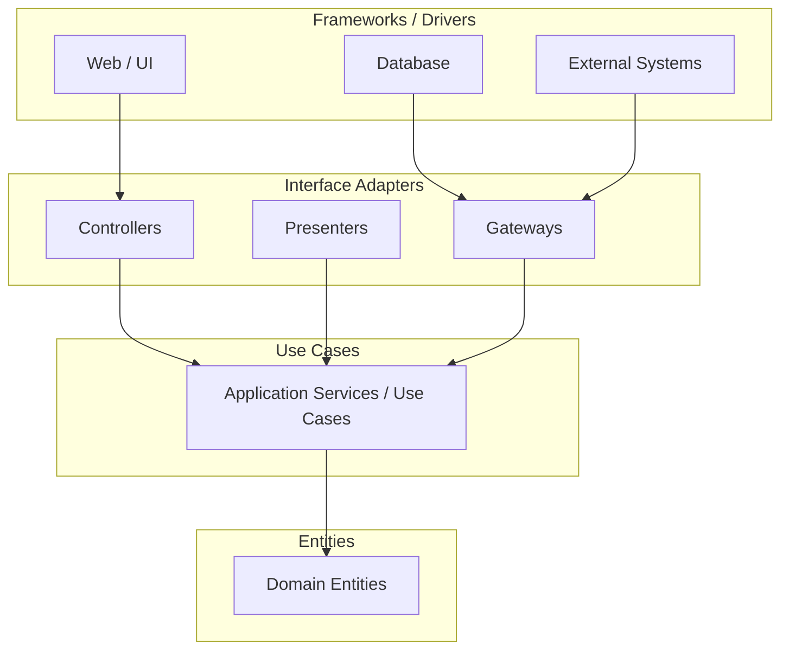
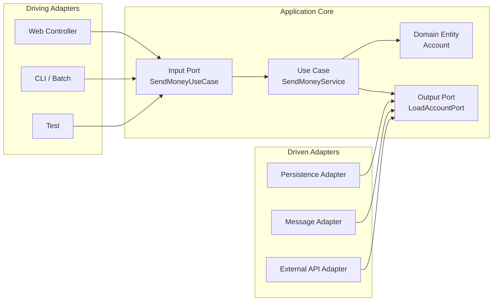

## 1. 대안: 의존성의 방향을 바꾼다

계층형 아키텍처의 문제는 단순히 계층이 있다는 사실이 아니다.
문제는 중요한 코드인 도메인 로직이 바깥 기술에 끌려가기 쉽다는 점이다.

```text
Web
  → Domain
    → Persistence
      → Database
```

이 구조에서는 도메인 계층이 영속성 계층을 알고,
영속성 계층은 DB와 ORM framework를 안다.
결과적으로 DB schema, ORM mapping, repository 구현 방식이 바뀌면 도메인 코드까지 같이 흔들릴 수 있다.

개선 방향은 반대다.

```text
Web Adapter ───────┐
                   ▼
              Application / Domain
                   ▲
Persistence Adapter┘
```

도메인 코드가 바깥 기술을 알지 않게 하고,
바깥 기술 코드가 도메인 쪽 인터페이스에 맞춰 들어오게 만든다.
이게 의존성 역전의 핵심이다.

---

## 2. 단일 책임 원칙

단일 책임 원칙(SRP, Single Responsibility Principle)은 흔히 "하나의 컴포넌트는 하나의 일만 해야 한다"로 설명된다.
하지만 로버트 C. 마틴의 설명에 따르면 핵심은 "하나의 software module은 변경될 이유가 하나뿐이어야 한다"는 것이다.

```text
SRP
  = 하나의 일만 한다
  보다는
  = 변경될 이유가 하나뿐이다
```

두 설명은 비슷해 보이지만 초점이 다르다.
"하나의 일"은 기능의 개수를 세는 느낌이고,
"변경 이유"는 누가, 어떤 요구 때문에 이 코드를 바꾸는지를 보는 관점이다.

변경 이유가 하나라면 수정 범위가 예측 가능해진다.

```text
변경 요청: 이체 한도 정책 변경
  → 이체 유스케이스 / 도메인 규칙만 변경
  → 웹 controller, DB adapter, 외부 API adapter는 변경 이유가 아님
```

아키텍처 관점에서 SRP는 "컴포넌트를 변경 사유별로 나누라"는 의미다.

| 변경 사유 | 변경되어야 할 위치 |
|---|---|
| 비즈니스 정책 변경 | domain, use case |
| HTTP API 형식 변경 | web adapter |
| DB schema / ORM 변경 | persistence adapter |
| 외부 시스템 API 변경 | external adapter |

이렇게 나뉘면 특정 변경이 들어왔을 때 어느 코드를 봐야 하는지 명확해진다.
반대로 한 컴포넌트가 여러 변경 사유를 동시에 가지면,
작은 변경도 여러 책임을 건드리게 되고 회귀 위험이 커진다.

---

## 3. 의존성 역전 원칙

의존성 역전 원칙(DIP, Dependency Inversion Principle)은 고수준 정책이 저수준 세부사항에 의존하지 않게 하라는 원칙이다.

계층형 아키텍처에서는 보통 의존성이 아래로 흐른다.

```text
Domain Service
  → Repository
    → ORM / DB
```

이 구조에서는 도메인 서비스가 영속성 계층의 구체 타입을 알기 쉽다.
그러면 영속성 구현이 바뀔 때 도메인도 같이 바뀐다.

의존성 역전은 이 방향을 뒤집는다.
도메인 계층에 repository interface를 두고,
영속성 계층이 그 interface를 구현하게 만든다.

```text
Application / Domain
  ├── SendMoneyUseCase
  └── LoadAccountPort     ← interface
          ▲
          │ implements
Persistence Adapter
  └── AccountPersistenceAdapter
```

도메인 코드는 interface만 안다.
JPA, JDBC, Redis, 외부 API 같은 세부 기술은 adapter가 담당한다.

```java
public interface LoadAccountPort {
    Account loadAccount(AccountId accountId);
}
```

```java
class SendMoneyService {

    private final LoadAccountPort loadAccountPort;

    SendMoneyService(LoadAccountPort loadAccountPort) {
        this.loadAccountPort = loadAccountPort;
    }
}
```

```java
class AccountPersistenceAdapter implements LoadAccountPort {

    private final SpringDataAccountRepository repository;

    @Override
    public Account loadAccount(AccountId accountId) {
        AccountJpaEntity entity = repository.findById(accountId.value()).orElseThrow();
        return mapToDomain(entity);
    }
}
```

이제 도메인 로직은 Spring Data JPA를 모른다.
JPA entity도 모른다.
영속성 계층이 도메인 계층의 port에 맞춰 구현된다.

---

## 4. 클린 아키텍처

로버트 C. 마틴의 Clean Architecture는 비즈니스 규칙이 framework, database, UI, 외부 interface와 독립적이어야 한다고 말한다.
즉 의존성은 바깥에서 안쪽으로만 향해야 한다.



위 그림을 원형 도식으로 보면 가장 안쪽에 엔티티가 있고,
그 주변에 유스케이스, 인터페이스 어댑터, framework/driver가 있다.
의존성은 항상 안쪽을 향한다.

```text
Frameworks / Drivers
  → Interface Adapters
    → Use Cases
      → Entities
```

코어에는 도메인 엔티티가 있다.
그 주변의 유스케이스는 도메인 엔티티를 사용해서 애플리케이션의 기능을 수행한다.

유스케이스는 넓은 서비스 하나로 뭉치는 대신,
단일 책임에 맞게 작게 나뉘는 편이 좋다.

```text
SendMoneyUseCase
WithdrawMoneyUseCase
DepositMoneyUseCase
CloseAccountUseCase
```

이렇게 하면 "이 시스템이 제공하는 기능"이 코드 구조에서 드러난다.
또 각 유스케이스는 변경 이유가 좁아진다.

도메인 코드는 어떤 영속성 framework를 쓰는지,
UI가 REST인지 GraphQL인지,
외부 시스템과 HTTP로 통신하는지 Kafka로 통신하는지 알 필요가 없다.
덕분에 도메인 모델은 비즈니스 문제에 맞게 자유롭게 설계할 수 있다.

### 4.1. 분리의 대가

Clean Architecture는 대가가 있다.
외부 기술과 도메인을 철저히 분리하려면 계층마다 모델을 따로 둘 수 있다.

```text
Web Request DTO
  ↕ mapping
Use Case Command
  ↕ mapping
Domain Entity
  ↕ mapping
JPA Entity
```

예를 들어 JPA를 사용하면 DB schema를 매핑하기 위한 JPA entity가 필요하다.
하지만 도메인 entity가 JPA annotation과 lifecycle에 의존하면 도메인은 JPA에 묶인다.

그래서 도메인 entity와 JPA entity를 분리한다.

```java
// domain
class Account {
    private final AccountId id;
    private Money balance;
}
```

```java
// persistence adapter
@Entity
class AccountJpaEntity {
    @Id
    private Long id;

    private BigDecimal balance;

    protected AccountJpaEntity() {
    }
}
```

JPA는 기본 생성자 같은 제약을 요구한다.
도메인 모델이 JPA와 결합되어 있다면 도메인 객체도 그 제약을 따라야 한다.
하지만 모델을 분리하면 JPA의 제약은 persistence adapter 안에 갇힌다.

mapping 코드는 비용이다.
하지만 그 비용을 지불하면 도메인 코드에서 framework 결합을 제거할 수 있다.

---

## 5. Hexagonal Architecture

Clean Architecture는 의존성 방향에 대한 원칙을 설명한다.
Hexagonal Architecture는 이 원칙을 ports와 adapters라는 더 구체적인 구조로 표현한다.

Alistair Cockburn이 설명한 Hexagonal Architecture의 핵심은 애플리케이션 내부와 외부를 분리하고,
외부 actor가 port를 통해 애플리케이션과 통신하게 만드는 것이다.
그래서 Ports and Adapters Architecture라고도 부른다.

육각형은 본질이 아니다.
중요한 것은 "안쪽 애플리케이션 코어"와 "바깥 어댑터"의 경계다.
육각형 모양은 여러 port와 adapter를 한 방향 계층 그림보다 대칭적으로 보여주기 위한 표현이다.



육각형 안에는 도메인 엔티티와 유스케이스가 있다.
애플리케이션 코어는 port에만 의존한다.
외부 기술은 adapter로 밀려난다.

---

### 5.1. Driving Adapter

Driving adapter는 애플리케이션을 호출하는 쪽이다.
즉 애플리케이션을 "주도"한다.

예시:

```text
사용자 HTTP 요청
  → Web Controller
  → SendMoneyUseCase
  → SendMoneyService
```

이때 input port는 보통 애플리케이션 코어 안에 있는 use case interface다.
adapter는 이 interface를 호출한다.

```java
public interface SendMoneyUseCase {
    void sendMoney(SendMoneyCommand command);
}
```

```java
@RestController
class SendMoneyController {

    private final SendMoneyUseCase sendMoneyUseCase;

    @PostMapping("/accounts/send")
    void send(@RequestBody SendMoneyRequest request) {
        sendMoneyUseCase.sendMoney(mapToCommand(request));
    }
}
```

여기서 controller는 driving adapter다.
controller가 use case를 호출해서 애플리케이션을 움직인다.

---

### 5.2. Driven Adapter

Driven adapter는 애플리케이션 코어가 호출하는 바깥 기술이다.
즉 애플리케이션에 의해 "주도되는" 쪽이다.

예시:

```text
SendMoneyService
  → LoadAccountPort
  → AccountPersistenceAdapter
  → Database
```

이때 output port도 애플리케이션 코어 안에 있는 interface다.
하지만 구현체는 바깥 adapter에 있다.

```java
public interface LoadAccountPort {
    Account loadAccount(AccountId accountId);
}
```

```java
class AccountPersistenceAdapter implements LoadAccountPort {

    private final SpringDataAccountRepository repository;

    @Override
    public Account loadAccount(AccountId accountId) {
        return mapToDomain(repository.findById(accountId.value()).orElseThrow());
    }
}
```

헷갈리는 지점은 port의 위치다.

| 구분 | port 위치 | 구현 위치 | 호출 방향 |
|---|---|---|---|
| Driving side | application core | use case service가 구현 | adapter → core |
| Driven side | application core | external adapter가 구현 | core → adapter interface |

두 경우 모두 port는 application core 쪽에 둔다.
차이는 누가 호출하고 누가 구현하느냐다.

---

## 6. 정리

Clean Architecture와 Hexagonal Architecture의 표현은 다르지만 목표는 같다.

```text
도메인 코드가 바깥 기술에 의존하지 않게 한다.
```

이를 위해 의존성을 역전시킨다.
도메인과 유스케이스는 port interface에만 의존하고,
웹, DB, 메시징, 외부 API 같은 기술 코드는 adapter로 바깥에 둔다.

효과는 세 가지다.

| 효과 | 설명 |
|---|---|
| 결합 감소 | 도메인 코드가 framework, DB, UI 변경에 덜 흔들림 |
| 변경 이유 감소 | 컴포넌트별 변경 사유가 좁아짐 |
| 모델링 자유도 증가 | 도메인을 기술 제약이 아니라 비즈니스 문제에 맞게 설계 가능 |

결국 의존성 역전은 도메인 로직을 보호하기 위한 수단이다.
도메인 코드가 바깥 세부사항에 끌려가지 않을수록 유지보수성이 좋아진다.

---

## 7. 참고

- [도서] 만들면서 배우는 클린 아키텍처 - 톰 홈버그(Tom Hombergs)
- [The Single Responsibility Principle - Robert C. Martin](https://blog.cleancoder.com/uncle-bob/2014/05/08/SingleReponsibilityPrinciple.html)
- [The Clean Architecture - Robert C. Martin](https://blog.cleancoder.com/uncle-bob/2012/08/13/the-clean-architecture.html)
- [Hexagonal Architecture - Alistair Cockburn](https://alistair.cockburn.us/hexagonal-architecture)
