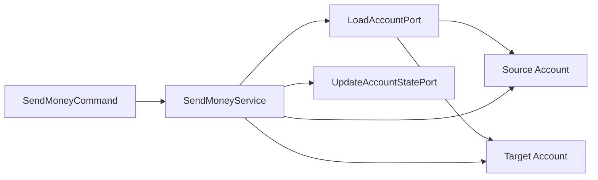

> **Note: Rich(풍부한) Domain Model vs Anemic(빈약한) Domain Model**
>
> **Rich Domain Model**은 도메인 객체가 상태와 행위를 함께 가진다.
> 예를 들어 `Account`가 잔고 계산, 출금 가능 여부 확인, 출금/입금 활동 등록 같은 비즈니스 행위를 직접 수행한다.
>
> **Anemic Domain Model**은 도메인 객체가 상태만 가지고, 대부분의 비즈니스 로직은 service에 있다.
> 객체는 getter/setter 중심의 데이터 컨테이너가 되고, service가 절차적으로 상태를 조작한다.
>
> Clean/Hexagonal Architecture가 항상 rich model을 강제하는 것은 아니다.
> 다만 도메인 규칙이 중요한 시스템에서는 rich model이 비즈니스 규칙을 도메인 안에 모으기 쉽다.

## 1. 도메인 모델 구현하기

계좌 송금 유스케이스를 객체지향적으로 모델링하면 단순하다.

```text
출금 계좌에서 출금
  → 입금 계좌로 입금
```

이때 핵심 도메인 객체는 `Account`다.
`Account`는 계좌의 입금/출금 활동을 알고, 출금 가능 여부와 잔고 계산을 책임진다.

아래 코드는 구조 설명용 축약 예시다.
생성자와 getter는 생략했다.

```java
package buckpal.account.domain;

public class Account {

    private AccountId id;
    private Money baselineBalance;
    private ActivityWindow activityWindow;

    public Money calculateBalance() {
        return Money.add(
                baselineBalance,
                activityWindow.calculateBalance(this.id)
        );
    }

    public boolean withdraw(Money money, AccountId targetAccountId) {
        if (!mayWithdraw(money)) {
            return false;
        }

        Activity withdrawal = new Activity(
                this.id,
                this.id,
                targetAccountId,
                LocalDateTime.now(),
                money
        );

        activityWindow.addActivity(withdrawal);
        return true;
    }

    public boolean deposit(Money money, AccountId sourceAccountId) {
        Activity deposit = new Activity(
                this.id,
                sourceAccountId,
                this.id,
                LocalDateTime.now(),
                money
        );

        activityWindow.addActivity(deposit);
        return true;
    }

    private boolean mayWithdraw(Money money) {
        return Money.add(calculateBalance(), money.negate()).isPositiveOrZero();
    }
}
```

모든 입금/출금은 `Activity` entity로 포착된다.
하지만 계좌의 모든 활동을 매번 메모리에 올릴 수는 없다.
그래서 `ActivityWindow` value object가 최근 며칠 또는 몇 주 범위의 활동만 들고 있다.

`Account`는 `baselineBalance`도 가진다.
이 값은 `ActivityWindow`의 첫 번째 활동 직전 잔고다.

```text
현재 잔고
  = baselineBalance
  + activityWindow 안의 모든 활동 합
```

> **Note: ActivityWindow를 메모리에 들고 있어도 되는가?**
>
> `ActivityWindow`는 영구 저장소를 대체하는 구조가 아니다.
> 계좌의 전체 활동 내역은 DB에 저장되어 있고, application service가 유스케이스 실행에 필요한 범위만 로드해서 `Account`를 복원한다고 보면 된다.
>
> 서버가 내려가면 메모리의 `ActivityWindow`는 사라진다.
> 하지만 변경된 활동은 유스케이스가 끝날 때 outgoing port를 통해 persistence adapter에 저장되어야 한다.
>
> 즉 이 구조는 "최근 활동만 메모리에 캐싱한다"가 아니라,
> "도메인 규칙을 계산하기 위해 필요한 활동 범위만 도메인 객체에 올린다"는 예시다.
> 실제 운영에서는 트랜잭션, 동시성 제어, 저장 실패 처리까지 persistence adapter와 application service에서 함께 다뤄야 한다.

---

## 2. 유스케이스 둘러보기

송금 유스케이스의 흐름은 다음과 같다.

```text
1. 입력 모델 검증
2. 출금 계좌 로드
3. 입금 계좌 로드
4. 출금 계좌에서 출금
5. 입금 계좌에 입금
6. 변경된 활동 저장
```

입력 유효성 검증은 유스케이스의 핵심 비즈니스 규칙은 아니다.
하지만 application 계층의 책임이다.

비즈니스 규칙 검증은 유스케이스와 도메인 엔티티가 함께 책임진다.
예를 들어 "잔고가 부족하면 출금할 수 없다"는 규칙은 `Account.withdraw()` 안에 둘 수 있다.



`SendMoneyService`는 incoming port의 구현체다.
그리고 outgoing port를 통해 계좌를 불러오고 변경 상태를 저장한다.

```java
class SendMoneyService implements SendMoneyUseCase {

    private final LoadAccountPort loadAccountPort;
    private final UpdateAccountStatePort updateAccountStatePort;

    @Override
    public boolean sendMoney(SendMoneyCommand command) {
        Account sourceAccount = loadAccountPort.loadAccount(command.sourceAccountId());
        Account targetAccount = loadAccountPort.loadAccount(command.targetAccountId());

        if (!sourceAccount.withdraw(command.money(), targetAccount.getId())) {
            return false;
        }

        if (!targetAccount.deposit(command.money(), sourceAccount.getId())) {
            return false;
        }

        updateAccountStatePort.updateActivities(sourceAccount);
        updateAccountStatePort.updateActivities(targetAccount);

        return true;
    }
}
```

---

## 3. 입력 유효성 검증

입력 유효성 검증을 호출 adapter에 맡기면 문제가 생긴다.

```text
web adapter
batch adapter
message adapter
```

각 adapter가 같은 유스케이스를 호출한다면,
모든 adapter가 같은 입력 검증을 반복해야 한다.
하나라도 누락하면 유스케이스는 잘못된 입력을 받을 수 있다.

따라서 입력 유효성 검증은 application 계층에 두는 편이 안전하다.
다만 유스케이스 service 코드가 검증 코드로 오염되지 않게 input model이 검증을 책임지게 한다.

`SendMoneyCommand`는 유스케이스 API의 일부이므로 `application.port.in`에 둔다.
필드를 `final`로 두고 생성자에서 검증하면 생성 이후 잘못된 상태로 바뀔 수 없다.

```java
package buckpal.account.application.port.in;

public class SendMoneyCommand {

    private final AccountId sourceAccountId;
    private final AccountId targetAccountId;
    private final Money money;

    public SendMoneyCommand(
            AccountId sourceAccountId,
            AccountId targetAccountId,
            Money money
    ) {
        this.sourceAccountId = requireNonNull(sourceAccountId);
        this.targetAccountId = requireNonNull(targetAccountId);
        this.money = requireNonNull(money);
        requireGreaterThan(money, Money.ZERO);
    }

    private void requireGreaterThan(Money value, Money min) {
        if (!value.isGreaterThan(min)) {
            throw new IllegalArgumentException("money must be greater than zero");
        }
    }
}
```

Java에서는 Bean Validation API를 활용해 입력 검증을 annotation으로 표현할 수도 있다.

```java
package buckpal.account.application.port.in;

public class SendMoneyCommand extends SelfValidating<SendMoneyCommand> {

    @NotNull
    private final AccountId sourceAccountId;

    @NotNull
    private final AccountId targetAccountId;

    @NotNull
    private final Money money;

    public SendMoneyCommand(
            AccountId sourceAccountId,
            AccountId targetAccountId,
            Money money
    ) {
        this.sourceAccountId = sourceAccountId;
        this.targetAccountId = targetAccountId;
        this.money = money;
        validateSelf();
    }
}
```

```java
public abstract class SelfValidating<T> {

    private final Validator validator;

    protected SelfValidating() {
        ValidatorFactory factory = Validation.buildDefaultValidatorFactory();
        validator = factory.getValidator();
    }

    protected void validateSelf() {
        Set<ConstraintViolation<T>> violations = validator.validate((T) this);

        if (!violations.isEmpty()) {
            throw new ConstraintViolationException(violations);
        }
    }
}
```

검증은 application core 안에 남아 있다.
하지만 유스케이스 service가 아니라 input model이 처리하므로 유스케이스 흐름은 깨끗하게 유지된다.

---

## 4. 생성자의 힘

`SendMoneyCommand`는 생성자에 책임이 많다.
필드가 많아지면 생성자가 길어질 수 있다.

이때 private 생성자와 builder pattern을 사용할 수도 있다.
하지만 builder는 필드 추가 시 누락을 컴파일러가 강하게 잡아주지 못하는 경우가 있다.

```text
필드 추가
  → builder 호출부에 새 필드 세팅 누락
  → 컴파일 성공
  → 런타임 검증 또는 테스트에서 발견
```

반면 생성자를 직접 호출하면 필수 파라미터가 추가될 때 컴파일 에러가 난다.

```text
필드 추가
  → 생성자 signature 변경
  → 기존 호출부 compile error
  → 수정 위치 즉시 발견
```

요즘 IDE는 생성자 호출부에서 파라미터명 힌트를 보여준다.
따라서 필수 값이 명확한 command 객체라면 builder보다 생성자가 더 안전할 수 있다.

---

## 5. 유스케이스마다 다른 입력 모델

유스케이스마다 필요한 입력은 비슷해 보여도 검증 규칙이 다를 수 있다.

예를 들어 계좌 등록과 계좌 정보 수정은 거의 같은 필드를 사용할 수 있다.
하지만 검증 규칙은 다를 수 있다.

| 유스케이스 | 입력 모델 | 검증 |
|---|---|---|
| 계좌 등록 | `RegisterAccountCommand` | `accountId` 없음, owner 정보 필수 |
| 계좌 수정 | `UpdateAccountCommand` | `accountId` 필수, 수정 가능한 필드만 허용 |

하나의 입력 모델에서 어떤 유스케이스는 `null`을 허용하고,
다른 유스케이스는 금지한다면 모델의 의미가 흐려진다.

```java
class AccountCommand {
    private final AccountId accountId; // 등록에서는 null, 수정에서는 not null?
}
```

이런 모델은 유효성 검증도 복잡해진다.
`if (mode == REGISTER)` 같은 분기가 command 안에 들어가면 입력 모델이 여러 유스케이스를 동시에 떠안는다.

입력 모델은 유스케이스별로 분리하는 편이 낫다.
그래야 각 command가 자기 유스케이스에 맞는 검증 규칙을 가질 수 있다.

```java
class RegisterAccountCommand {
    private final OwnerId ownerId;
    private final Money initialBalance;
}
```

```java
class UpdateAccountCommand {
    private final AccountId accountId;
    private final OwnerId ownerId;
}
```

경계 간 어떤 매핑 전략이 적절한지는 유스케이스 성격에 따라 달라진다.
CRUD 중심이면 같은 모델을 공유하는 전략도 가능하고,
비즈니스 규칙이 복잡하면 유스케이스별 command와 계층별 모델을 분리하는 편이 안전하다.

이 방식은 매핑 코드가 늘어날 수 있다.
하지만 각 유스케이스의 입력 계약과 검증 규칙이 명확해진다.

---

## 6. 참고

- [도서] 만들면서 배우는 클린 아키텍처 - 톰 홈버그(Tom Hombergs)
- [Bean Validation specification](https://beanvalidation.org/)
