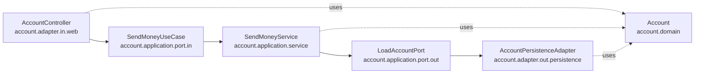
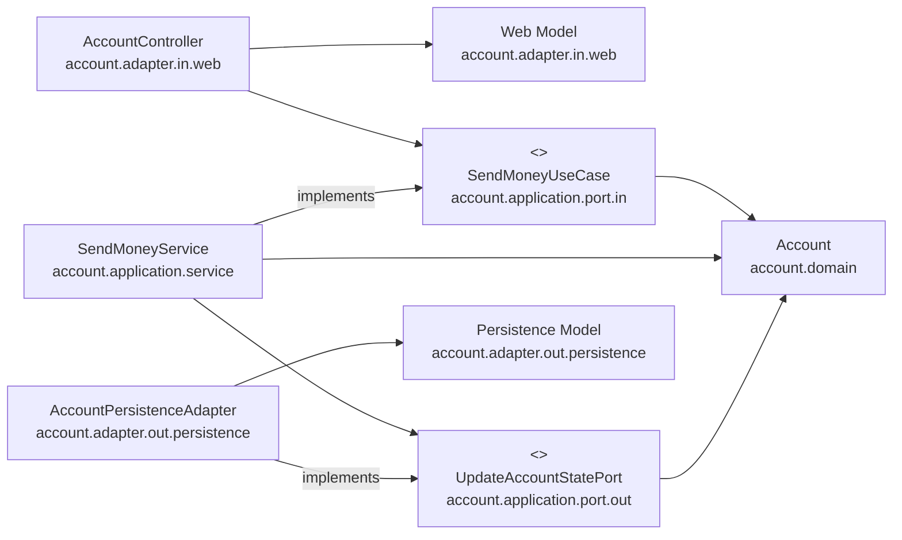
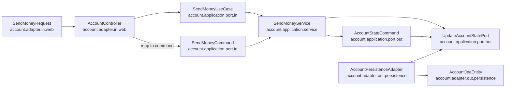
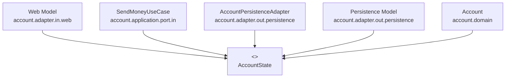

## 1. 요약: 매핑 전략은 선택이다

계층 사이에서 모델을 매핑할지에 대한 의견은 갈린다.

| 입장 | 이유 |
|---|---|
| 매핑 찬성 | 같은 모델을 여러 계층이 공유하면 계층 간 강결합이 생김 |
| 매핑 반대 | 보일러플레이트 코드가 많아지고 개발 속도가 느려짐 |

둘 다 맞는 말이다.

중요한 것은 어떤 매핑 전략도 철칙처럼 여기면 안 된다는 점이다.
유스케이스마다 적절한 전략을 선택할 수 있어야 한다.

```text
단순 CRUD
  → 매핑하지 않기 가능

복잡한 비즈니스 유스케이스
  → 계층별 모델 / 유스케이스별 입력 모델 분리 고려
```

매핑은 목적이 아니라 결합을 관리하기 위한 수단이다.

---

## 2. 매핑하지 않기 전략

매핑하지 않기 전략은 모든 계층이 같은 모델을 사용하는 방식이다.



장점은 단순함이다.
별도 매핑 코드 없이 같은 모델을 전달하면 된다.

```text
web
  → Account
application
  → Account
persistence
  → Account
```

간단한 CRUD 유스케이스라면 이 전략이 가장 경제적일 수 있다.
모든 계층이 정확히 같은 구조와 정보를 필요로 한다면 굳이 모델을 나눌 이유가 약하다.

단점은 계층별 요구사항이 하나의 모델에 섞인다는 점이다.

| 계층 | 모델에 요구할 수 있는 것 |
|---|---|
| web | JSON 직렬화 annotation, request/response 형식 |
| persistence | ORM mapping annotation, 기본 생성자, proxy 제약 |
| application/domain | 비즈니스 규칙, 불변식, 도메인 행위 |

이 요구가 모두 `Account` 하나에 들어가면 단일 책임 원칙을 어기기 쉽다.

또 특정 계층에서만 필요한 필드가 모델에 추가될 수 있다.
그러면 도메인 모델이 여러 계층의 요구를 조금씩 담은 파편화된 모델이 된다.

하지만 JSON이나 ORM annotation이 한두 개 붙는 정도이고,
유스케이스가 단순 CRUD라면 큰 문제가 아닐 수 있다.
이 전략으로 시작했다가 유스케이스가 복잡해지면 나중에 매핑을 도입해도 된다.

---

## 3. 양방향 매핑 전략

양방향 매핑 전략은 각 계층이 자기 전용 모델을 가지고,
경계를 넘을 때 서로 변환하는 방식이다.

다이어그램으로 표현하면 다음과 같다.



web adapter는 web model을 domain model로 변환한다.
persistence adapter는 persistence model을 domain model로 변환한다.

```text
Web Model
  ↔ Domain Model
  ↔ Persistence Model
```

장점은 각 계층이 독립적으로 변할 수 있다는 점이다.

| 계층 | 전용 모델 |
|---|---|
| web | request/response DTO |
| application/domain | 도메인 모델 |
| persistence | JPA entity |

웹 API 응답 형식이 바뀌어도 도메인 모델은 영향을 덜 받는다.
DB schema나 ORM mapping이 바뀌어도 도메인 모델은 오염되지 않는다.
그래서 단일 책임 원칙을 만족하기 쉽다.

또 `매핑하지 않기` 다음으로 이해하기 쉬운 전략이다.
안쪽과 바깥쪽 계층 사이에 모델을 하나씩 더 두고 변환하면 된다.

단점은 보일러플레이트 코드다.

```text
toDomain()
toJpaEntity()
toResponse()
toCommand()
```

mapping framework를 써도 비용이 사라지지는 않는다.
특히 framework가 reflection, generic, annotation processing을 많이 사용하면 디버깅이 어려울 수 있다.

또 하나의 단점은 도메인 모델이 계층 경계의 통신 모델로 사용된다는 점이다.
incoming/outgoing port가 도메인 객체를 입력값이나 반환값으로 사용하면,
바깥 계층의 요구 때문에 도메인 모델이 변경될 가능성이 남는다.

따라서 양방향 매핑도 silver bullet이 아니다.
많은 프로젝트에서 단순 CRUD에도 양방향 매핑을 무조건 적용하는데,
그 경우 개발 속도만 늦추고 얻는 이득은 작을 수 있다.

> **Note: Silver Bullet**
>
> "Silver bullet"은 원래 괴물을 한 번에 죽이는 은탄환이라는 비유다.
> 소프트웨어에서는 어떤 복잡한 문제를 한 번에 해결하는 만능 해법이라는 뜻으로 쓰인다.
>
> Frederick P. Brooks Jr.는 1986년 논문 **No Silver Bullet: Essence and Accidents of Software Engineering**에서
> 10년 안에 소프트웨어 개발 생산성, 신뢰성, 단순성을 10배 개선할 단일 기술이나 방법론은 없다고 주장했다.
>
> Brooks는 소프트웨어의 어려움을 본질적 복잡성(essence)과 우발적 복잡성(accident)으로 나눴다.
> 도구와 언어는 우발적 복잡성을 줄일 수 있지만,
> 문제 자체의 복잡성, 변경 가능성, 개념적 구조 같은 본질적 복잡성은 사라지지 않는다는 것이다.
>
> 그래서 "silver bullet이 아니다"라는 표현은
> 어떤 기술이나 패턴도 모든 상황에 무조건 맞는 만능 해결책은 아니라는 의미로 쓰인다.

---

## 4. 완전 매핑 전략

완전 매핑 전략은 각 연산마다 별도 입출력 모델을 두는 방식이다.
양방향 매핑보다 더 강하게 경계를 나눈다.
각 계층은 자기 전용 모델을 사용하고, 모델 이름도 역할에 맞게 `Request`, `Command` 같은 단어로 표현한다.



이 전략에서는 web request가 곧바로 domain model이 되지 않는다.
`SendMoneyRequest`는 web adapter의 모델이고,
`SendMoneyCommand`는 유스케이스의 입력 모델이다.

```text
SendMoneyRequest
  → SendMoneyCommand
    → SendMoneyUseCase
```

웹 계층은 입력을 application 계층의 command 객체로 매핑할 책임을 가진다.
각 유스케이스별 command 객체에는 그 유스케이스에 필요한 필드와 유효성 검증 로직이 들어간다.

```text
SendMoneyRequest
  → HTTP 요청 형식

SendMoneyCommand
  → 송금 유스케이스 입력 계약
  → 송금에 필요한 유효성 검증
```

outgoing 방향에도 전용 모델을 둘 수 있다.
예를 들어 `AccountStateCommand`를 만들어 application service가 persistence port에 전달할 변경 상태를 명시할 수 있다.

```text
SendMoneyService
  → AccountStateCommand
    → UpdateAccountStatePort
```

다만 이 전략을 application과 persistence 계층 사이까지 무조건 적용하는 것은 비용이 클 수 있다.
persistence 쪽은 이미 JPA entity와 domain model 사이 매핑이 존재하는 경우가 많아서,
여기에 port 전용 command까지 추가하면 매핑 단계가 과해질 수 있다.

완전 매핑 전략의 장점은 유스케이스 계약이 매우 명확하다는 점이다.

| 모델 | 위치 | 책임 |
|---|---|---|
| `SendMoneyRequest` | `adapter.in.web` | HTTP 요청 표현 |
| `SendMoneyCommand` | `application.port.in` | 송금 유스케이스 입력과 검증 |
| `AccountStateCommand` | `application.port.out` | 영속성 adapter에 전달할 계좌 상태 변경 요청 |
| `Account` | `domain` | 도메인 규칙 |
| `AccountJpaEntity` | `adapter.out.persistence` | DB mapping |

웹 모델을 도메인 모델로 바로 매핑하는 방식보다 코드는 더 많다.
하지만 여러 유스케이스를 하나의 범용 mapping이 처리하려는 방식보다 구현과 유지보수가 쉬울 수 있다.

여기서 비교 대상은 "하나의 web model 또는 하나의 account model을 여러 유스케이스가 공유하는 매핑"이다.
예를 들어 `AccountRequest` 하나를 등록, 수정, 송금, 출금에 모두 쓰면 각 유스케이스마다 필요한 필드와 검증 규칙이 달라진다.
결국 mapper와 model 안에 분기와 nullable field가 늘어난다.

```text
범용 AccountRequest
  → register에서는 accountId 없어야 함
  → update에서는 accountId 필요
  → sendMoney에서는 source/target/money 필요
  → 분기 증가
```

반면 유스케이스별 command는 모델이 많아지는 대신 각 모델의 의미가 좁고 명확하다.

```text
RegisterAccountCommand
UpdateAccountCommand
SendMoneyCommand
```

단점은 매핑 코드가 가장 많다는 점이다.
따라서 모든 CRUD에 기본값처럼 적용하기보다,
입력 검증과 유스케이스 계약이 중요한 복잡한 기능에 우선 적용하는 편이 낫다.

특히 이 전략은 incoming adapter와 application 계층 사이에서 상태 변경 유스케이스의 경계를 명확히 할 때 좋다.
반대로 application과 persistence 계층 사이에는 매핑 오버헤드가 커질 수 있으므로 신중하게 적용한다.

또 input model에만 완전 매핑을 적용하고, output model은 도메인 객체를 그대로 반환하는 식으로 섞어 쓸 수 있다.

```text
입력:
  SendMoneyRequest → SendMoneyCommand

출력:
  SendMoneyUseCase → Account 반환
```

중요한 것은 여러 전략을 섞어 쓸 수 있다는 점이다.
어떤 매핑 규칙도 전역 규칙일 필요는 없다.

---

## 5. 단방향 매핑 전략

단방향 매핑 전략은 모든 계층의 모델이 같은 상태 interface를 구현하게 하는 방식이다.
이 interface는 관련 attribute에 대한 getter를 제공한다.

예를 들어 `AccountState` interface를 둔다.

```java
public interface AccountState {
    AccountId getId();
    Money getBalance();
    List<Activity> getActivities();
}
```

각 계층 모델은 이 interface를 구현한다.

```text
Account
SendMoneyUseCase input/output model
Web Model
Persistence Model
AccountPersistenceAdapter
  → AccountState에 의존
```



도메인 계층은 여전히 풍부한 행동을 구현할 수 있다.
`Account`는 `AccountState`를 구현하면서도 출금, 입금, 잔고 계산 같은 행위를 가진다.

```java
class Account implements AccountState {

    boolean withdraw(Money money, AccountId targetAccountId) {
        // business rule
    }

    boolean deposit(Money money, AccountId sourceAccountId) {
        // business rule
    }
}
```

도메인 객체를 바깥에 전달하고 싶다면 별도 매핑이 필요 없을 수 있다.
도메인 객체가 incoming/outgoing port가 기대하는 `AccountState`를 이미 구현하고 있기 때문이다.

바깥 계층은 선택할 수 있다.

```text
AccountState를 그대로 사용
또는
전용 web/persistence model로 매핑
```

application 계층에서는 `AccountState`를 실제 도메인 모델인 `Account`로 재구성해서 도메인 행동에 접근할 수 있다.
이 매핑은 DDD의 factory 개념과 대응된다.
factory는 특정 상태로부터 도메인 객체를 재구성할 책임을 가진다.

```java
class AccountFactory {

    Account from(AccountState state) {
        return new Account(
                state.getId(),
                state.getBalance(),
                state.getActivities()
        );
    }
}
```

이 전략의 장점은 매핑 방향이 명확하다는 점이다.
각 계층은 자신이 받은 상태를 자기 모델로 한 방향 매핑한다.
따라서 객체가 계층 사이를 넘어가도 `AccountState`라는 공통 계약으로 읽을 수 있다.

단점은 개념적으로 어렵다는 점이다.
`AccountState`가 여러 계층에 걸쳐 퍼지고,
각 모델이 같은 interface를 구현하므로 다른 전략보다 추적하기 어렵다.

이 전략은 계층 간 모델이 비슷할 때 가장 효과적이다.
특히 읽기 전용 연산에서는 `AccountState`가 필요한 정보를 모두 제공한다면,
web 계층에서 별도 응답 모델로 매핑하지 않아도 된다.

---

## 6. 언제 어떤 매핑 전략을 사용할 것인가

정답은 그때그때 다르다.
특정 작업에 최선의 패턴이 아님에도 "깔끔해 보인다"는 이유만으로 선택하는 것은 무책임하다.

소프트웨어는 계속 변한다.
처음에는 빠르게 코드를 작성할 수 있는 단순한 매핑 전략으로 시작하고,
필요해지면 계층 간 결합을 떼어내는 더 복잡한 전략으로 갈아타도 된다.

팀에는 어떤 전략을 언제 사용할지 합의한 가이드라인이 필요하다.
그리고 그 가이드라인은 "왜 이 전략이 이 상황에서 최선인가"에 답할 수 있어야 한다.

예를 들어 변경 유스케이스와 쿼리 유스케이스에 서로 다른 규칙을 둘 수 있다.
또 web/application 사이와 application/persistence 사이에 서로 다른 매핑 전략을 둘 수 있다.

| 작업 | 경계 | 첫 번째 선택 | 바꿔야 하는 경우 |
|---|---|---|---|
| 변경 유스케이스 | web ↔ application | 완전 매핑 전략 | 입력 모델이 지나치게 단순하고 검증 차이가 거의 없음 |
| 변경 유스케이스 | application ↔ persistence | 매핑하지 않기 전략 | application 계층이 persistence 관심사를 다루기 시작함 |
| 쿼리 유스케이스 | web ↔ application | 매핑하지 않기 전략 | application 계층이 web 표현 문제를 다루기 시작함 |
| 쿼리 유스케이스 | application ↔ persistence | 매핑하지 않기 전략 | application 계층이 persistence schema/ORM 문제를 다루기 시작함 |

변경 유스케이스에서 web/application 사이에 완전 매핑 전략을 먼저 선택하는 이유는,
유스케이스 간 결합을 줄이고 유스케이스별 유효성 검증 규칙을 명확히 하기 위함이다.
특정 유스케이스에 필요 없는 필드를 다루지 않아도 된다.

반면 변경 유스케이스의 application/persistence 사이에서는 매핑 오버헤드를 줄이기 위해 매핑하지 않기 전략으로 시작할 수 있다.
다만 application 계층에서 persistence 문제를 다루기 시작하면 양방향 매핑으로 바꾼다.

쿼리 유스케이스는 보통 비즈니스 규칙보다 데이터 조회와 표현이 중요하다.
따라서 web/application, application/persistence 사이 모두 매핑하지 않기 전략으로 빠르게 시작할 수 있다.
물론 application 계층이 web 또는 persistence 문제를 떠안게 되면 양방향 매핑으로 바꾼다.

이런 가이드라인이 성공하려면 팀원들이 규칙을 숙지해야 한다.
또 프로젝트가 변하면 가이드라인도 계속 논의하고 수정해야 한다.

---

## 7. 유지보수 가능한 소프트웨어를 만드는 데 어떻게 도움이 될까

incoming/outgoing port는 계층 간 통신을 정의한다.
따라서 port를 설계할 때 어떤 매핑 전략을 사용할지도 함께 결정된다.

유스케이스별로 좁은 port를 사용하면 유스케이스마다 다른 매핑 전략을 선택할 수 있다.
하나의 유스케이스에서 전략을 바꿔도 다른 유스케이스에 영향을 덜 준다.

```text
SendMoneyUseCase
  → 완전 매핑 전략

GetAccountQuery
  → 매핑하지 않기 전략
```

매핑 가이드라인이 있으면 팀은 일관된 기준으로 선택할 수 있다.
처음에는 번거롭지만, 시간이 지나면 유지보수하기 쉬운 코드로 보상받는다.

---

## 8. 정리

매핑 전략은 상황에 따라 선택한다.

| 상황 | 적절한 전략 |
|---|---|
| 단순 CRUD, 계층별 요구사항이 거의 같음 | 매핑하지 않기 |
| 도메인 규칙이 중요하고 계층별 요구사항이 다름 | 양방향 매핑 |
| 유스케이스별 입력 검증이 다름 | [유스케이스별 command 모델](./4_implement-use-case/) |
| 계층별 모델 구조가 거의 같고 읽기 중심임 | 단방향 매핑 전략 |

처음부터 모든 유스케이스에 복잡한 매핑을 강제할 필요는 없다.
반대로 비즈니스 규칙이 중요한 유스케이스에서 같은 모델을 모든 계층이 공유하는 것도 위험하다.

매핑은 언제든 바꿀 수 있는 설계 선택이다.
중요한 것은 유스케이스별 변경 이유와 계층 간 결합을 보고 적절한 전략을 선택하는 것이다.

---

## 9. 참고

- [도서] 만들면서 배우는 클린 아키텍처 - 톰 홈버그(Tom Hombergs)
- Frederick P. Brooks Jr., [No Silver Bullet: Essence and Accidents of Software Engineering](https://www.cs.unc.edu/techreports/86-020.pdf)
